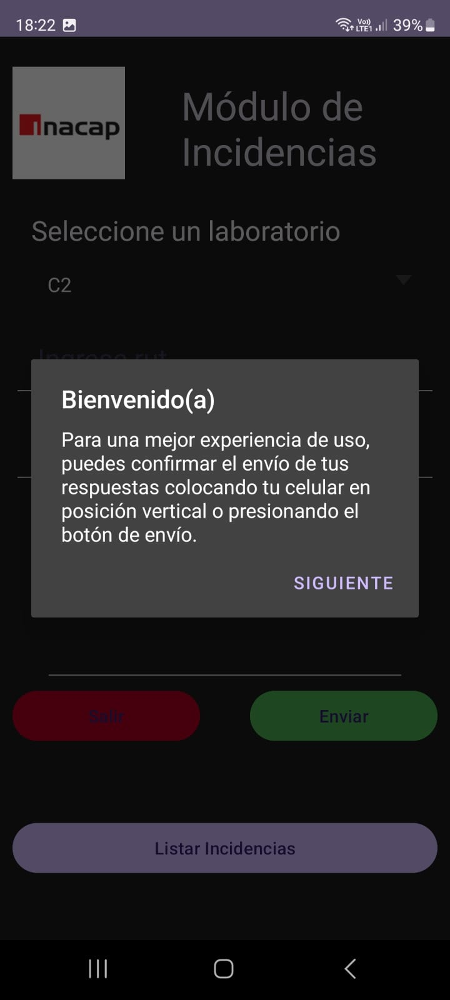

# Aplicacion movil para incidentes de laboratorio.

Aplicacion para documentar incidentes de laboratorio y almacenar la informacion en un registro de base de datos.
Esta aplicación móvil simplifica el proceso de envío de datos al ofrecer dos métodos intuitivos: mediante el botón de envío o simplemente girando el dispositivo en 90 grados. Ambas opciones son igualmente efectivas y garantizan la integridad de los datos al verificarlos antes del envío.
 
## Características Principales

Envío de Datos Versátil: Los usuarios pueden enviar datos de dos formas:

Botón de Envío: Presionando el botón de envío disponible en la interfaz de usuario.

Giro del Dispositivo: Girando el dispositivo en 90 grados, lo que activa automáticamente la función de envío.

Verificación de Campos: Antes de enviar los datos, la aplicación verifica cada campo para asegurarse de que estén correctamente completados y sean válidos.

## Instrucciones de Uso

Abrir la Aplicación: Inicie la aplicación móvil en su dispositivo.
Completar los Campos: Complete todos los campos requeridos en el formulario de envío.
Verificar la Información: Revise cuidadosamente cada campo para asegurarse de que estén correctamente completados y sean válidos.
Enviar los Datos:
Presione el botón "Enviar" en la interfaz de usuario O
Simplemente gire su dispositivo en 90 grados para activar automáticamente la función de envío.

si algun dato no es correcto o no esta presente se mostrara una alerta que dira que es lo que tiene que corregir.

---

##aplicacion

